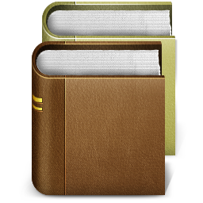

# `build.pwsh` documentation

## Install build.pwsh

-	Download latest release of [Tiny Powershell Framework](https://github.com/cadegenn/pwsh_fw/releases) for your OS
-	Install it hte usual way
-	Download latest release of [build.pwsh](https://github.com/cadegenn/build.pwsh/releases) for your OS from [this github repository](https://github.com/cadegenn/build.pwsh)
-	Install it hte usual way

## Requirements

The following files are required for a project to build :

-	CHANGELOG.md : your changelog file (see [keepachanglelog.com](https://keepachangelog.com/en/1.0.0/) for a start)
-	LICENSE
-	README.md
-	VERSION : just one line with the current version of your project with 3 digits. No new line. e.g. `1.2.3`

The following files are recommended :

-	images/favicon.ico (for building a windows setup)
-	images/favicon.png (for building a linux package)
-	images/favicon.icns (for building a macOS package)

## Create build environment

You will need to add these folders / files :

-   create `build` directory at the root of the project
-   write a `build.rc` text file in this directory (see below)
-   write a `build.conf.ps1` script file in this directory (see below)

## Files

### File `build.rc`

`build.rc` contains constant strings related to project. It must contain at least the following :

```bash
PRODUCT_CODENAME="project-code-name"
PRODUCT_FULLNAME="Project's full name"
PRODUCT_NAME="project-name"
PRODUCT_SHORTNAME="project-shortname"
PRODUCT_DESCRIPTION="Description of the project."
PRODUCT_ID="org.company.department.project"
PRODUCT_PUBLISHER="Fullname of author"
PRODUCT_PUBLISHER_EMAIL="author@company.com"
PRODUCT_WEB_SITE="https://github.com/owner/project"
PRODUCT_COPYRIGHT="GPL v3+"
PRODUCT_UNINST_ROOT_KEY="HKLM"
PRODUCT_UNINST_KEY="Software\\Microsoft\\Windows\\CurrentVersion\\Uninstall\\project"
DEFAULT_LINUX_INSTALL_DIR="/opt"
#DEFAULT_MACOS_INSTALL_DIR="/Applications/Utilities"
DEFAULT_MACOS_INSTALL_DIR="/opt"
DEFAULT_WINDOWS_INSTALL_DIR="C:\\Program Files"
```

> **NOTE**: later in this documentation, `${PRODUCT_SOMETHING}` will refer to the variable defined in this file.

### File `build.conf.ps1`

`build.conf.ps1` contains a list of files and folders that must be included in packages. An example is :

```powershell
$Script:Folders = @("images", "includes", "Modules")
$Script:Files = @("CHANGELOG.md", "README.md", "LICENSE", "VERSION", "app.ps1")
```

> **NOTE**: You must at least include `CHANGELOG.md`, `LICENSE`, and `VERSION` files

### Create build environment for target OS

-	create build env for [debian](DEBIAN.md)
-	create build env for [macOS](MACOS.md)
-	create build env for [Windows](WINDOWS.md)
